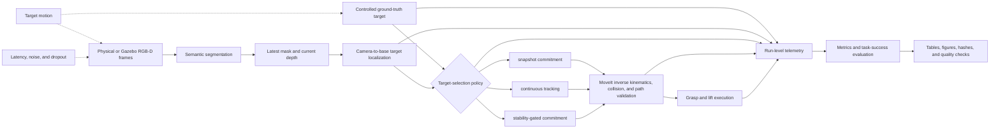

# Stability-Gated Closed-Loop Eye-in-Hand Tracking and Grasping

ROS 2 research code for stability-gated closed-loop eye-in-hand tracking and grasping, combining semantic RGB-D perception, Piper manipulation, Gazebo/MoveIt simulation, and reproducible benchmark evaluation under target motion and perception disturbances.

This repository accompanies an **IEEE EPIC 2026 short-paper submission**. It is research software, not a certified industrial safety controller. Test in plan-only mode first, keep the workspace clear, provide an emergency stop, and verify every motion on the actual robot before enabling actuation.

## Paper

**Stability-Gated Closed-Loop Eye-in-Hand Tracking and Grasping of a Manually Moved Target**

Zhang Yue and Xinlei Lin, IEEE EPIC 2026 short-paper submission.

The paper is not described as accepted or published. Citation information will be updated after the conference decision.

## Contributions and roles

This repository combines a pre-existing Piper RGB-D grasping pipeline, the
stability-gated tracking-to-grasp study direction, and the present work's
simulation, benchmarking, and evaluation infrastructure.

**Zhang Yue** proposed the continuous target-tracking and stability-gated
tracking-to-grasp study direction, leads the manuscript preparation, and serves
as first author of the associated IEEE EPIC 2026 short-paper submission.

**Xinlei Lin** led the subsequent software implementation, simulation,
integration, and experimental evaluation in this repository, including the ROS
2/Gazebo/MoveIt simulation framework, tracking-policy integration, simulated
RGB-D pipeline, benchmark and disturbance-evaluation infrastructure,
quantitative analysis, grasp-physics validation, and final experiment-audit
tooling.

**Wei Liu** provided the Piper manipulator and RGB-D experimental platform and
collaborated on the development and validation of the physical robotic system.
The underlying repository also builds on an earlier shared grasping pipeline
developed through collaboration between Zhang Yue and Wei Liu.

See [Project provenance](#project-provenance) for the detailed development
history and relationship to the earlier shared codebase.

## Evaluation at a glance

The repository keeps controlled ground-truth and simulated semantic RGB-D
experiments in separate formal evaluation tracks.

| Evaluation track | Formal scale | Methods | Experimental design |
| --- | ---: | --- | --- |
| Controlled ground-truth | 120 canonical trials | `snapshot`, `tracking`, `gated` | 3 methods x 2 scenarios x seeds 42-61 |
| Simulated semantic RGB-D | 30 canonical trials | `snapshot`, `tracking`, `gated` | 3 methods x 2 scenarios x seeds 42-46 |

`snapshot` commits the first valid target, `tracking` follows the latest target
estimate, and `gated` waits for the configured stability criteria before target
commitment. Each canonical trial selects one finished attempt for a method,
scenario, and seed; infrastructure reruns retain their provenance without
duplicating the denominator.

Here, `gated` is the simulation target-commitment policy: it checks 3-D
position spread, stability duration, minimum sample count, and observation
freshness. It is not a one-factor implementation of the complete physical
readiness gate, which also checks image centering, grasp-workspace/boundary
validity, measured-command and measured-IK joint errors, and commanded joint
rate.

The campaigns use matched target trajectories and deterministic seeds. The
runner records target, method, planning, execution, and physical lift/hold
evidence for each trial. The final audit requires canonical `task_success=true`
and `physical_grasp_success=true` for task success. A successful MoveIt plan,
trajectory completion, or Gazebo attachment does not establish task success.

## Key quantitative results

Controlled ground-truth trials isolate target-selection behavior from semantic
perception errors.

| Method | Static task success | Move-stop task success |
| --- | ---: | ---: |
| `snapshot` | 20/20 | 0/20 |
| `tracking` | 20/20 | 20/20 |
| `gated` | 20/20 | 20/20 |

Snapshot committed an early target and ended all 20 controlled move-stop trials
at physical verification. Tracking and gated completed all 40 controlled trials
across the two scenarios.

Simulated semantic RGB-D trials exercise segmentation, depth fusion, and
camera-to-base localization before the policy receives a target.

| Method | Static task success | Move-stop task success |
| --- | ---: | ---: |
| `snapshot` | 5/5 | 0/5 |
| `tracking` | 0/5 | 0/5 |
| `gated` | 5/5 | 5/5 |

All 30 simulated RGB-D trials recorded at least one successful MoveIt/path plan.
Snapshot ended its five move-stop trials at the grasp stage. Tracking ended all
10 trials at the task-level planning stage because it could not satisfy the
fresh, low-drift PREGRASP (planned pre-grasp pose) commitment conditions within
the frozen limits. Gated completed all 10 trials. Each RGB-D condition contains
five trials, so these counts describe the frozen simulator configuration and do
not estimate real-camera performance.

The source cells appear in
`results/final_experiment_summary/table_1_controlled_success.csv`,
`results/final_experiment_summary/table_2_rgbd_success.csv`, and
`results/final_experiment_summary/table_3_rgbd_detailed_outcome.csv`. The final
audit bundle remains local because Git ignores `results/`.

## System architecture



Both formal tracks use the same method-policy and task-evaluation interfaces.
The controlled track supplies target ground truth to the policy. The simulated
semantic RGB-D track reaches the policy through segmentation, depth fusion, and
camera-to-base localization; it does not substitute ground-truth coordinates
for the perception output.

## System scope

### Physical perception and grasping pipeline

The physical-system pipeline includes:

- semantic RGB-D perception for cube, cylinder, and sphere classes;
- depth fusion and eye-in-hand camera-to-base target localization;
- MoveIt-based IK, collision checking, and grasp-path validation;
- continuous selected-class target following with bounded joint-rate servoing;
- stability-gated target commitment and grasp readiness;
- operator-authorized physical `GRASP -> LIFT` execution with explicit safety checks.

The 5 s gate only authorizes `HOLD/readiness`; it does not automatically start a physical grasp. The operator must confirm that the workspace is clear and issue the execution command.

### Simulation and evaluation framework

The repository also includes a reproducible Gazebo/MoveIt simulation and evaluation framework for closed-loop target tracking and grasping:

- `snapshot`, `tracking`, and `gated` method policies under a common evaluation interface;
- moving-target and simulated-perception models with configurable latency, noise, and dropout;
- simulated eye-in-hand RGB-D perception using the same perception/localization pipeline as the physical system;
- deterministic benchmark campaigns with paired seeds and configurations;
- baseline comparison, latency sweep, noise sweep, dropout sweep, and gate-ablation suites;
- run-level telemetry and metrics for tracking error, readiness error, grasp-initiation error, time-to-ready, gate resets, planning success, and task success;
- offline paired analysis, deterministic bootstrap confidence intervals, result tables, and publication-oriented plots.

### Gazebo grasp stabilization backend

The formal simulator baseline uses `grasp_stabilization_mode:=gazebo_grasp_fix`.
This selects the pinned `gazebo_grasp_fix` plugin and the no-attachment world;
the legacy contact-confirmed attach service remains off. The plugin only
stabilizes an already commanded grasp in Gazebo. It does not replace
perception, target tracking, readiness gating, target commitment, or the grasp
trigger. Mechanical task success is accepted only from the physical lift/hold
fields in `metrics.json`, never from attachment or motion completion alone.

Install the pinned third-party plugin once, then source the project runtime:

```bash
bash scripts/setup_gazebo_grasp_plugin.sh
source scripts/source_env.sh
```

The setup script records the exact upstream revision in
`dependencies/gazebo_grasp_plugin.repos` and installs the shared library under
`.external/gazebo-grasp-install/lib/`. See `THIRD_PARTY.md` for license and
patch provenance.

## Reproducible simulation and benchmarking

The three target-selection policies run through a common simulation and
evaluation interface. Packaged benchmark suites cover baseline comparison,
latency, perception noise, observation dropout, and stability-gate ablations.
Deterministic configuration hashes and paired seeds expose each method to
matched target trajectories and disturbance conditions.

Each run records target ground truth, observations, selected and committed targets, TCP state, joint state, readiness, and execution events. Offline analysis produces run-level metrics, grouped summaries, paired method differences, deterministic bootstrap confidence intervals, and publication-oriented plots.

See [`docs/SIMULATION_BENCHMARK.md`](docs/SIMULATION_BENCHMARK.md) for the complete benchmark contract and reproduction commands.

## Final frozen experiment audit

The repository includes a read-only Python audit for the completed formal
campaigns. It reads the canonical `trials.csv` rows and each trial's
`metadata.json`, `events.csv`, `states.csv`, and `metrics.json`. The workflow
does not start ROS/Gazebo/MoveIt or modify the source campaigns. Generate the
audit bundle with:

```bash
python3 scripts/generate_final_experiment_summary.py
```

The generator writes the Chinese report, trial-level and grouped CSV files,
paper tables, figures, input hashes, and quality-assurance records to
`results/final_experiment_summary/`. Qualification runs remain outside the
formal denominators. Infrastructure reruns retain their provenance and enter
each denominator once through the canonical attempt.

## Current limitations

The formal results describe the frozen controlled and simulated RGB-D
configurations; they do not establish general statistical superiority or
real-camera physical performance. The current system also does not establish
motion prediction, same-class distractor rejection, or repeated-trial physical
grasp success.

## Project provenance

Zhang Yue and Wei Liu developed the original project together. Wei Liu
published an earlier version of the shared codebase, including contributions
from both collaborators, under his GitHub account at
[`WillLiu322/foam-grasp-ros2`](https://github.com/WillLiu322/foam-grasp-ros2).
That repository predates the present repository and already contained semantic
RGB-D perception, camera-to-base target localization, MoveIt-based motion
planning and validation, target latching, and the Piper grasp-execution
pipeline. Wei Liu provided the codebase for the present study with permission.

Zhang Yue proposed the continuous target-tracking and stability-gated
tracking-to-grasp study direction and leads the associated manuscript. Wei Liu
provided the Piper manipulator and RGB-D platform and collaborated on physical
system development and validation.

Building on that pipeline, Xinlei Lin led the subsequent software implementation
and evaluation development in this repository. This work expanded the project
into a reproducible simulation and benchmarking platform with real/simulation
execution, Gazebo/MoveIt integration, target-motion and perception-disturbance
models, comparative policy execution, simulated eye-in-hand RGB-D perception,
grasp-physics qualification, benchmark campaigns, metrics, offline analysis,
and final experiment auditing. The Git history records the staged pull-request
series through PR #16 and subsequent commits for RGB-D validation, grasp
stabilization, benchmark hardening, and final audit tooling.

The present repository combines the pre-existing robotic grasping system, the
stability-gated tracking study direction, and the subsequent simulation,
benchmarking, integration, and evaluation software developed for the current
work. This provenance statement describes collaboration and software history;
it does not determine manuscript authorship.

## Repository layout

```text
config/                         machine-level project and runtime settings
data/                           dataset instructions only; raw data is excluded
dependencies/                   vcs manifests for ROS 2 dependencies
docs/                           deployment, operation, and reproducibility notes
patches/                        minimal upstream patches
runtime/                        model/calibration instructions and model card
scripts/                        installation, validation, benchmark, audit, and release helpers
training/                       capture, labeling, training, and evaluation scripts
workspaces/app_ws/              physical foam_grasp and Gazebo/benchmark foam_grasp_sim ROS 2 packages
analysis/                       offline metrics, paired comparisons, bootstrap CIs, tables, and plots
```

Raw images, LabelMe annotations, generated masks, training runs, rosbag files, model checkpoints, and hardware calibration JSON are not committed to ordinary Git history. See `data/README.md` and `runtime/models/README.md` or `runtime/calibration/README.md` for the intended release channels.

General analysis tools consume campaign artifacts only and write to a separate
`<campaign_id>-analysis/` directory. The final frozen experiment audit is a
separate read-only workflow and writes to `results/final_experiment_summary/`.

## Requirements

### Simulation and benchmark workflow

- Ubuntu 22.04 LTS
- ROS 2 Humble
- Gazebo and MoveIt 2
- Python dependencies listed in the repository
- NVIDIA CUDA/PyTorch environment only when running the semantic-segmentation RGB-D pipeline

### Physical-system workflow

In addition to the software requirements above:

- Piper manipulator and gripper
- Orbbec DaBai DC1 RGB-D camera
- verified hand-eye calibration and rig-specific runtime assets

## Installation and validation

```bash
git clone https://github.com/Zhang-GTIIT/stability-gated-eye-in-hand-grasping.git
cd stability-gated-eye-in-hand-grasping
chmod +x install.sh scripts/*.sh
cp config/project.env.example config/project.env
# Edit config/project.env for the target rig before a supervised run.
./install.sh
./scripts/validate_project.sh
./scripts/check_github_ready.sh
```

The installer does not start ROS, enable the robot, or send motion commands. Start with the plan-only launch files and verify the camera, transforms, IK, collision checks, and gripper feedback before any physical execution.

## Runtime assets

The trained model and rig-specific hand-eye calibration are intentionally distributed as versioned release assets rather than committed to normal Git history. The current `config/runtime-release.env` retains the verified legacy release source for those assets because the model and calibration have not been migrated into this repository's releases. Do not substitute a new URL until matching assets and checksums have been published and tested.

Calibration is valid only for the camera, mount, and Piper rig used to create it. A different rig requires a new calibration profile and a separate release asset.

## License and third-party software

The project is released under the Apache License 2.0. Third-party components retain their respective upstream licenses; see [`THIRD_PARTY.md`](THIRD_PARTY.md) and the dependency manifests.

## Security and responsible use

Do not commit API tokens, passwords, private keys, `.env` secrets, machine inventories, or local absolute paths. Use the release checklist and security guidance before publishing a new tag or runtime asset.
