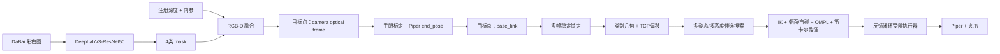
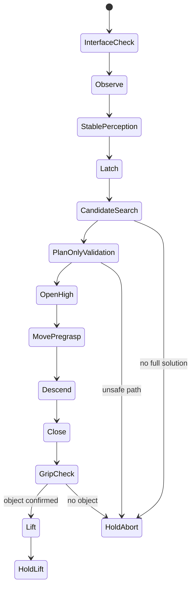

# Foam Grasp 完整工程与工作流程

本文是项目的主文档，覆盖从硬件与 SDK、数据采集、标注、训练、手眼标定，
到 ROS 2 在线感知、MoveIt 规划、Piper 自动抓取、迁移和 GitHub 发布的完整
闭环。命令均假设工程位于：

```text
~/robot_projects/foam_grasp_project
```

项目脚本实际按自身路径定位根目录，因此也可以放在其他用户目录；不要在
`~/Downloads` 内长期构建和运行。

> 本项目控制真实机械臂。执行任何带 `--execute` 的程序或 `启动.sh` 前，
> 必须确认工作空间无人、夹爪内无手指、线缆不受拉扯并保持硬件急停可触及。

## 1. 最终目标与系统边界

输入是 DaBai DC1 的 RGB-D 图像和用户选择的目标类别：

```text
cube / cylinder / sphere
```

输出是 Piper 对所选目标执行：

```text
观察 → 稳定识别 → 锁定目标 → 预抓取 → 下降 → 闭合 → 夹持确认 → 抬升
```

语义分割只区分类别，不直接决定关节角。目标 3D 坐标来自分割 mask 与注册
深度，坐标变换来自手眼标定，机械臂姿态和路径由 MoveIt 服务计算，最终命令
由本项目的受限执行器发送给 Piper 驱动。

## 2. 已验证的软硬件基线

| 项目 | 基线 |
|---|---|
| 操作系统 | Ubuntu 22.04 x86_64 |
| ROS | ROS 2 Humble |
| RGB-D 相机 | Orbbec DaBai DC1，legacy `OrbbecSDK_ROS2` |
| 机械臂 | AgileX Piper，带平行夹爪 |
| CAN | SocketCAN `can0`，1,000,000 bit/s |
| GPU | NVIDIA RTX A4000（已验证） |
| 分割模型 | DeepLabV3 + ResNet-50，4 类 |
| PyTorch | 2.5.1+cu121 |
| Torchvision | 0.20.1+cu121 |
| NumPy | 1.26.4 |
| Piper SDK | 0.6.1 |
| python-can | 4.6.1 |

模型输入为 `640×360`，预测结果再恢复到相机彩色图尺寸。相机真实发布分辨率
必须在每次更换驱动配置后用 ROS 话题检查，不应由文档猜测。

## 3. 总体架构



坐标变换使用：

```text
p_base = T_base_gripper · T_gripper_camera · p_camera
```

`T_base_gripper` 来自 `/end_pose`，`T_gripper_camera` 来自
`runtime/calibration/handeye_eye_in_hand.json`。

## 4. 工程目录

完整文件边界见根目录 `PROJECT_MANIFEST.md`。四个 ROS 工作空间按下列顺序
叠加：

```text
/opt/ros/humble
  → workspaces/orbbec_ws/install
  → workspaces/piper_ws/install
  → workspaces/moveit_ws/install（可选）
  → workspaces/app_ws/install
```

`app_ws` 是唯一自研工作空间。Orbbec、Piper 和可选 MoveIt 源码不直接提交
到本项目 Git，而由 `dependencies/*.repos` 固定提交并重建。

## 5. 从零安装 SDK 与工程

### 5.0 准备全新电脑和工程目录

推荐使用全新或干净的 Ubuntu 22.04 x86_64。首次开机后先确认系统版本、架构、
磁盘和 NVIDIA GPU：

```bash
cat /etc/os-release | grep -E 'PRETTY_NAME|VERSION_ID'
uname -m
df -h /home
lspci | grep -i nvidia
```

期望系统为 Ubuntu 22.04、架构为 `x86_64`，并至少预留 30 GB 用于源码、编译、
Python 环境和模型；若还要保存数据集与 rosbag，建议预留 100 GB 以上。

安装最基础的下载和版本管理工具：

```bash
sudo apt update
sudo apt install -y git curl wget ca-certificates gnupg lsb-release
mkdir -p ~/robot_projects
```

课程默认不提供项目源码、模型、标定或部署包。学生从空目录创建工程：

```bash
mkdir -p ~/robot_projects/foam_grasp_project
cd ~/robot_projects/foam_grasp_project

mkdir -p \
  config data dependencies docs requirements scripts training \
  runtime/models runtime/calibration venvs \
  workspaces/orbbec_ws/src \
  workspaces/piper_ws/src \
  workspaces/moveit_ws/src \
  workspaces/app_ws/src

git init
touch README.md .gitignore
```

加载 ROS 后创建自研包：

```bash
source /opt/ros/humble/setup.bash
cd ~/robot_projects/foam_grasp_project/workspaces/app_ws/src
ros2 pkg create foam_grasp \
  --build-type ament_python \
  --license Apache-2.0 \
  --dependencies \
    rclpy sensor_msgs geometry_msgs visualization_msgs \
    std_msgs std_srvs cv_bridge tf2_ros moveit_msgs
```

学生随后按感知、三维融合、坐标转换、目标锁存、抓取位姿、MoveIt 检查、
观察姿态、夹爪测试和自动状态机的顺序实现自己的节点。第三方驱动可以使用课程
指定的公开仓库、分支和提交，但 `foam_grasp` 自研代码必须由学生完成。

私有部署包只在项目完成后用于作者自己的备份和跨电脑迁移，其中会包含作者代码、
模型与标定；它不是开始课程前要准备的依赖包，详见第 16 节。

### 5.1 安装 ROS 2 与系统依赖

以下步骤适用于 Ubuntu 22.04。先配置 UTF-8 locale 和 Ubuntu Universe：

```bash
sudo apt update
sudo apt install -y locales software-properties-common curl
sudo locale-gen en_US en_US.UTF-8
sudo update-locale LC_ALL=en_US.UTF-8 LANG=en_US.UTF-8
export LANG=en_US.UTF-8
sudo add-apt-repository universe
```

加入 ROS 2 官方软件源：

```bash
sudo curl -sSL \
  https://raw.githubusercontent.com/ros/rosdistro/master/ros.key \
  -o /usr/share/keyrings/ros-archive-keyring.gpg

echo "deb [arch=$(dpkg --print-architecture) signed-by=/usr/share/keyrings/ros-archive-keyring.gpg] http://packages.ros.org/ros2/ubuntu $(. /etc/os-release && echo $UBUNTU_CODENAME) main" \
  | sudo tee /etc/apt/sources.list.d/ros2.list >/dev/null

sudo apt update
sudo apt install -y ros-humble-desktop ros-dev-tools
```

若 ROS 官方此后调整了软件源安装方法，以 ROS 2 Humble 官方安装页为准，不要把
其他 Ubuntu 版本或 ROS 发行版的软件源混入本机。

验证基础 ROS：

```bash
source /opt/ros/humble/setup.bash
ros2 --help
printenv | grep -E '^ROS_(VERSION|DISTRO)='
ros2 doctor --report
```

期望 `ROS_VERSION=2`、`ROS_DISTRO=humble`。随后显式安装工程系统依赖：

```bash
sudo apt update
sudo apt install -y \
  git build-essential cmake rsync \
  python3-venv python3-pip python3-colcon-common-extensions \
  python3-rosdep python3-vcstool \
  libgflags-dev nlohmann-json3-dev libdw-dev \
  libopencv-dev python3-opencv \
  can-utils ethtool iproute2 usbutils \
  ros-humble-cv-bridge ros-humble-image-transport \
  ros-humble-image-view ros-humble-tf2-ros ros-humble-moveit
```

安装验证后，学生应把同一组命令整理成自己的
`scripts/install_system_dependencies.sh`，用于项目最终复现。

验证：

```bash
source /opt/ros/humble/setup.bash
ros2 --help
printenv | grep -E '^ROS_(VERSION|DISTRO)='
```

如果 `source /opt/ros/humble/setup.bash` 后仍找不到 `ros2`，不要继续编译；
先修复 ROS 安装。

### 5.2 导入第三方源码

课程资料应给出第三方公开仓库的 URL、ROS 2 分支和提交号。学生按指定版本下载；
不得猜测 Piper 的默认分支，因为上游默认分支可能是 ROS 1。下载完成后记录并
导出精确版本：

```bash
git -C workspaces/orbbec_ws/src/OrbbecSDK_ROS2 rev-parse HEAD
git -C workspaces/piper_ws/src/<Piper仓库目录> rev-parse HEAD

vcs export --exact workspaces/orbbec_ws/src \
  > dependencies/orbbec.repos
vcs export --exact workspaces/piper_ws/src \
  > dependencies/piper.repos
```

DaBai DC1 使用 legacy/OpenNI 驱动，不要被 `/opt/ros/humble` 中不含
`dabai.launch.py` 的新驱动覆盖。构建后检查：

```bash
source scripts/source_env.sh
ros2 pkg prefix orbbec_camera
ros2 run orbbec_camera list_devices_node
```

输出应指向本项目 `workspaces/orbbec_ws/install`，设备名应为 DaBai DC1。

### 5.3 安装 Orbbec udev 规则

```bash
cd workspaces/orbbec_ws/src/OrbbecSDK_ROS2/orbbec_camera/scripts
sudo bash install_udev_rules.sh
sudo udevadm control --reload-rules
sudo udevadm trigger
```

拔插相机。

### 5.4 Python/CUDA 运行环境

```bash
cd ~/robot_projects/foam_grasp_project
./scripts/install_python_runtime.sh
```

脚本创建带系统 ROS 包可见性的 venv，固定 NumPy 1.26，安装 PyTorch cu121，
修复 `libnvJitLink.so.12`，并验证 `torch`、`cv_bridge` 依赖链、
`python-can` 和 `piper_sdk`。

### 5.5 构建与静态验证

```bash
./scripts/build_all.sh
./scripts/validate_project.sh
./scripts/project_status.sh
```

也可在全新 Ubuntu 上执行：

```bash
./scripts/bootstrap_new_machine.sh --install-system
```

该脚本不会启动 ROS 或移动机械臂。

## 6. 模型与标定资产

在线启动前必须存在：

```text
runtime/models/best_model.pth
runtime/calibration/handeye_eye_in_hand.json
```

标定 JSON 至少包含：

```json
{
  "position": [0.0, 0.0, 0.0],
  "orientation": [0.0, 0.0, 0.0, 1.0]
}
```

这里是结构示例，不是可用标定值。更换相机、支架、夹爪、法兰安装或相机
朝向后必须重新标定，不能靠放宽抓取偏移和工作区阈值掩盖标定误差。

### 6.1 手眼标定的坐标定义

本工程为眼在手上（eye-in-hand）：相机刚性安装在末端，标定板固定在桌面。
需要求出：

```text
T_gripper_camera
```

它把相机 optical frame 中的点变换到夹爪/末端坐标系。在线坐标链为：

```text
p_base = T_base_gripper · T_gripper_camera · p_camera
```

不要把 `T_camera_gripper`、`T_gripper_camera` 或 base/end 的方向写反。OpenCV
`calibrateHandEye` 返回的正是 camera-to-gripper 旋转和平移，可直接按本项目
JSON 约定保存。

### 6.2 标定板、安装和采样准备

1. 将棋盘格、ChArUco 或 AprilTag 标定板固定在桌面，整个采样期间不得移动。
2. 将 DaBai DC1 和支架锁紧到末端；相机、支架或法兰只要松动过就重新标定。
3. 让标定板占彩色画面的 15%–60%，避免严重反光、过曝和运动模糊。
4. 启动相机和 Piper 反馈，确认彩色图、相机内参和 `/end_pose` 连续有效。
5. 推荐采集 20–30 组姿态，最低不要少于 15 组。

采样姿态必须包含明显的俯仰、偏航、滚转和不同距离；只做平移、旋转范围很小，
或所有姿态近似共面，会造成手眼方程病态。每个姿态到位后等待机械臂静止，再
同步保存：

```text
T_base_gripper    来自 /end_pose
T_camera_target   来自标定板检测
```

### 6.3 用 OpenCV 求解

将每组机器人位姿整理为 `R_gripper2base`、`t_gripper2base`，将标定板检测结果
整理为 `R_target2cam`、`t_target2cam`，然后调用：

```python
R_cam2gripper, t_cam2gripper = cv2.calibrateHandEye(
    R_gripper2base,
    t_gripper2base,
    R_target2cam,
    t_target2cam,
    method=cv2.CALIB_HAND_EYE_TSAI,
)
```

可同时计算 Tsai、Park、Horaud 等方法并比较重投影/闭环稳定性，但最终只能
选择一组经过独立验证的变换。把旋转矩阵转为 `xyzw` 四元数，平移统一换算为
米，写入：

```text
runtime/calibration/handeye_eye_in_hand.json
```

格式：

```json
{
  "position": [0.0123, -0.0456, 0.0789],
  "orientation": [0.001, 0.002, 0.003, 0.999]
}
```

示例数值仅用于说明格式，绝不能复制到真实系统。

### 6.4 标定验收

保留 5–10 个未参与求解的姿态作为验证集。对固定标定板上的同一个三维点，
使用每个姿态计算：

```text
p_base_target_i =
    T_base_gripper_i · T_gripper_camera · p_camera_target_i
```

如果标定正确，不同姿态得到的 base 坐标应聚集在固定位置。建议把“验证集平移
误差中位数小于 5 mm、最大误差小于 10 mm”作为原型工程目标，同时在 RViz
检查目标点是否贴合真实桌面位置。这个验收值是工程建议，不是本项目为了放行
动作而强行降低的安全阈值。

还应做一次运动一致性检查：固定桌面目标不动，缓慢改变机械臂观察姿态，
`/foam_grasp/{class}_point_base` 不应跟随机械臂明显漂移。若漂移超过约
10 mm，应优先检查标定方向、单位、时间同步、相机支架和 `/end_pose` 含义，
而不是调大抓取补偿。

### 6.5 模型资产验收

将训练得到的模型复制到运行目录后校验：

```bash
ls -lh runtime/models/best_model.pth
sha256sum runtime/models/best_model.pth
source scripts/source_env.sh
python - <<'PY'
import torch
path = "runtime/models/best_model.pth"
checkpoint = torch.load(path, map_location="cpu", weights_only=False)
print("checkpoint keys:", sorted(checkpoint.keys()))
print("epoch:", checkpoint.get("epoch"))
print("foreground_miou:", checkpoint.get("foreground_miou"))
PY
```

模型、类别顺序和在线节点必须一致：`background/cube/cylinder/sphere`。

## 7. 数据采集闭环

### 7.1 启动相机

先加载环境并启动相机（完整系统也会启动相机）：

```bash
source scripts/source_env.sh
ros2 launch orbbec_camera dabai.launch.py \
  depth_registration:=true \
  enable_ir:=false \
  enable_point_cloud:=false
```

另一个终端检查：

```bash
source scripts/source_env.sh
ros2 topic echo /camera/color/image_raw --once --field width
ros2 topic echo /camera/color/image_raw --once --field height
ros2 topic echo /camera/color/image_raw --once --field encoding
ros2 topic echo /camera/depth/image_raw --once --field encoding
```

采集训练 RGB 图片时只需要彩色话题；在线三维定位必须同时有注册深度和有效
`/camera/depth/camera_info`。

### 7.2 启动按键保存节点

```bash
mkdir -p data/raw/images/session_01
python3 training/capture_color_images_node.py \
  --output-dir data/raw/images/session_01
```

每调整一次物体、相机距离、背景或光照后，静止一秒，再在另一终端调用：

```bash
source scripts/source_env.sh
ros2 service call /foam_dataset/save std_srvs/srv/Trigger "{}"
```

批量手动触发：

```bash
while true; do
  read -r -p "调整物体并静止后按回车拍照，Ctrl+C退出："
  ros2 service call /foam_dataset/save std_srvs/srv/Trigger "{}"
done
```

采集时应覆盖三类物体、工作区位置、旋转、距离、明暗、阴影和部分遮挡。避免
从一段静止视频连续抽取大量几乎相同的帧；这会让测试指标虚高。当前历史实验
使用 369 对有效图片/mask，适合原型验证；若环境变化明显，应继续补充数据。

## 8. LabelMe 标注与 mask

建议把标注工具放入独立环境，避免污染在线 ROS/PyTorch 环境：

```bash
python3 -m venv venvs/labelme
source venvs/labelme/bin/activate
python -m pip install "numpy<2" labelme
labelme data/raw/images/session_01 \
  --output data/raw/annotations_labelme/session_01
```

标签名必须精确为：

```text
cube
cylinder
sphere
```

使用 polygon 沿可见物体轮廓标注。只出现一部分的目标，只要仍能确认类别，
就标注可见区域；无法辨认的小碎片可不纳入数据。开启 LabelMe 自动保存后，
关闭前仍要比较图片和 JSON 数量并解析全部 JSON。

转换：

```bash
python training/labelme_to_masks.py \
  --images-dir data/raw/images/session_01 \
  --annotations-dir data/raw/annotations_labelme/session_01 \
  --output-dir data/raw/masks/session_01
```

mask 像素约定：

```text
0 background
1 cube
2 cylinder
3 sphere
```

质量检查：

```bash
python training/make_mask_preview.py \
  --images-dir data/raw/images/session_01 \
  --masks-dir data/raw/masks/session_01 \
  --output-dir data/raw/previews/session_01 \
  --sample-count 24
```

必须查看 `mask_contact_sheet.jpg`，确认边缘、类别颜色和空洞正常。

## 9. 数据集划分、训练与测试

### 9.1 划分

```bash
python training/split_segmentation_dataset.py \
  --images-dir data/raw/images/session_01 \
  --masks-dir data/raw/masks/session_01 \
  --output-dir data/segmentation_dataset
```

若确认覆盖旧输出，增加 `--force`。脚本默认 80/10/10，并搜索 2,000 个
随机种子，使三个集合中的类别出现率接近全局分布。所有评估只使用 test，
不能在看到 test 结果后继续据此调参。

历史 369 张数据的划分为：

```text
train 295 / val 37 / test 37
```

### 9.2 模型

模型是 DeepLabV3 + ResNet-50：

- ResNet-50 提取多尺度视觉特征；
- DeepLabV3 使用空洞卷积和 ASPP 同时获取局部边缘与较大上下文；
- 最后输出 4 通道 logits，每个像素取最大类别；
- 训练使用 ImageNet/COCO 预训练初始化；
- 损失为带类别权重的交叉熵加前景 Dice loss；
- 训练增强包括水平翻转和颜色扰动；
- 在线推理使用 ImageNet 均值/方差、CUDA autocast 和 `torch.inference_mode()`。

### 9.3 烟雾测试和完整训练

```bash
source scripts/source_env.sh
python training/train_foam_segmentation.py \
  --smoke-test --batch-size 2 --workers 2

python training/train_foam_segmentation.py \
  --epochs 40 --batch-size 4 --workers 4
```

训练输出：

```text
data/training_runs/deeplabv3_resnet50/
├── best_model.pth
├── last_model.pth
└── train.log
```

### 9.4 独立测试

```bash
python training/evaluate_foam_segmentation.py \
  --dataset-root data/segmentation_dataset \
  --checkpoint data/training_runs/deeplabv3_resnet50/best_model.pth
```

已记录的原型测试结果：

| 指标 | 数值 |
|---|---:|
| Pixel accuracy | 0.998865 |
| Foreground mIoU | 0.973698 |
| Cube IoU | 0.965921 |
| Cylinder IoU | 0.980466 |
| Sphere IoU | 0.974709 |

这些结果只证明同一批数据划分上的表现，不等同于新背景、新相机或新光照的
泛化能力。必须同时检查生成的 comparison 和 contact sheet。

### 9.5 发布模型

```bash
cp data/training_runs/deeplabv3_resnet50/best_model.pth \
  runtime/models/best_model.pth
sha256sum runtime/models/best_model.pth
```

替换在线模型后，先只观察 `/foam_segmentation/overlay`，再做 plan-only，
最后才运行真机抓取。

## 10. 在线 ROS 节点与接口

| 节点 | 主要输入 | 主要输出 |
|---|---|---|
| `/foam_segmentation` | `/camera/color/image_raw` | `/foam_segmentation/mask`, `overlay`, `latency_ms` |
| `/foam_depth_fusion` | mask、depth、depth camera_info | `/foam_grasp/{class}_point`, `/foam_grasp/markers` |
| `/foam_camera_to_base` | 相机点、`/end_pose`、标定 JSON | `/foam_grasp/{class}_point_base` |
| `/foam_target_latch` | 三类 base 点 | 锁定话题、锁定类别、Trigger 服务 |
| `/foam_grasp_pose_preview` | 锁定点和类别 | 通用及分类 PREGRASP/GRASP/LIFT |
| `/move_group` | 真机反馈、规划场景、服务请求 | IK/规划/笛卡尔服务 |
| `/piper_ctrl_single_node` | 临时 `/joint_states` 命令 | `/joint_states_single`, `/end_pose`, `/arm_status` |

锁定服务：

```text
/foam_grasp/latch_cube
/foam_grasp/latch_cylinder
/foam_grasp/latch_sphere
/foam_grasp/clear_latched_target
```

## 11. 每次开机的标准运行流程

### 11.1 上电前

1. 机械臂工作区无人、无障碍物。
2. 硬件急停可立即触及。
3. 夹爪内无物体和手指。
4. 相机支架、夹爪和 CAN/USB 线缆牢固。
5. 同类别只放一个目标。

### 11.2 CAN

```bash
cd ~/robot_projects/foam_grasp_project
./scripts/setup_can.sh
timeout 5 candump -n 20 can0
```

`can0` 必须为 `UP,LOWER_UP` 且能收到 Piper 报文。只有接口 UP 但 RX 为 0
通常是机械臂电源、USB-CAN 或线缆接错。

### 11.3 启动完整系统

终端 1：

```bash
cd ~/robot_projects/foam_grasp_project
./scripts/start_system.sh
```

该 launch 启动 DaBai、Piper、安全 MoveIt、分割、深度融合、坐标转换、锁定
和位姿预览。MoveIt 设置：

```text
allow_trajectory_execution = false
moveit_manage_controllers = false
```

MoveIt 只做计算，不会绕过本项目安全状态机自行执行。

### 11.4 只读验收

终端 2：

```bash
cd ~/robot_projects/foam_grasp_project
./scripts/check_system.sh
```

关键条件：

```bash
source scripts/source_env.sh
ros2 topic info /joint_states
ros2 topic info /joint_states_single
ros2 param get /move_group allow_trajectory_execution
ros2 topic echo /foam_grasp/cube_point_base --once
```

抓取开始前 `/joint_states` 的发布者必须为 0；`/joint_states_single` 必须由
Piper 驱动发布；MoveIt 执行开关必须为 False。

### 11.5 选择目标并抓取

```bash
./启动.sh
```

输入 `1/2/3` 或 `cube/cylinder/sphere`。也可非交互：

```bash
./启动.sh cube
./启动.sh cylinder
./启动.sh sphere
```

类别夹爪参数：

| 类别 | 预张开 | 闭合命令 | 最小夹持余量 |
|---|---:|---:|---:|
| cube | 70 mm | 40 mm | 5 mm |
| cylinder | 90 mm | 55 mm | 4 mm |
| sphere | 70 mm | 45 mm | 5 mm |

夹爪先在观察高位张开，再保持开口移动和下降，避免在目标附近边张开边压物体。
闭合后实际开口必须比闭合命令大于最小余量，否则判定没有夹住并拒绝抬升。

## 12. 自动抓取内部状态机



候选生成不是固定单姿态。系统搜索：

- 55/50/45 mm 接近与抬升高度；
- 严格垂直和已记录近垂直姿态；
- 垂直轴偏航 `±15°/±30°`；
- 向目标径向外倾 5/10/15/20°；
- 径向内倾 5/10°；
- 切向微倾 `±5°/±10°`；
- 圆柱受限开口模式下的两侧弦偏移。

每个候选必须依次通过：

1. PREGRASP、GRASP、LIFT 三次带碰撞 IK；
2. 关节目标保留 0.01 rad 边界；
3. CURRENT→PREGRASP 完整规划；
4. PREGRASP→GRASP 100% 笛卡尔路径；
5. GRASP→LIFT 100% 笛卡尔路径；
6. 桌面碰撞和自碰检查；
7. 评分选择：姿态偏差、总关节行程、清空高度、轨迹时长、关节跳变和关节
   极限余量。

倾斜姿态使用 `tool_offset=0.1358 m` 将夹爪接触中心反算为 MoveIt `link6`
目标，避免把 link6 原点误认为夹爪 TCP。

## 13. 关键安全约束

这些阈值是拒绝错误执行的最后防线，不应因为一次失败就整体关闭：

| 检查 | 当前值 |
|---|---:|
| 感知锁定样本窗口 | 1.5 s |
| 最少稳定样本 | 15 |
| 最大 3D 扩散 | 10 mm |
| 锁定工作区 X | 0.15–0.60 m |
| 锁定工作区 \|Y\| | ≤0.35 m |
| 锁定工作区 Z | -0.02–0.20 m |
| PREGRASP 保守工作区 X | 0.20–0.55 m |
| PREGRASP 保守工作区 \|Y\| | ≤0.30 m |
| PREGRASP Z | 0.20–0.35 m |
| 当前末端最低高度（开始前） | 0.22 m |
| 静止时 10 帧最大关节波动 | 0.01 rad |
| 轨迹硬跟踪误差 | 0.20 rad |
| 到位关节误差 | 0.05 rad |
| 到位 link6 位置误差 | 20 mm |
| 笛卡尔相邻关节跳变 | ≤0.10 rad |
| 笛卡尔路径比例 | ≥0.999 |
| 候选稳健关节余量 | ≥0.040（归一化） |
| 回退轨迹起点误差 | ≤0.020 rad |

真实执行前还会检查机械臂错误码、关节通信、限位标志、反馈新鲜度、
`/joint_states` 发布互斥和 MoveIt 执行开关。

## 14. 速度配置

统一修改 `config/project.env`：

```bash
OBSERVE_SLOWDOWN=1.50
PREGRASP_SLOWDOWN=1.25
ARM_SPEED_PERCENT=15
AUTO_STAGE_PAUSE=0.50
CARTESIAN_JOINT_RATE=0.10
```

`slowdown` 越小越快，但程序限定不低于 1.25。Piper 驱动速度字段限定不高于
15%，笛卡尔关节速率不高于 0.10 rad/s。执行器会依据实际跟踪误差自动减慢
轨迹时间推进，但不会放宽 0.20 rad 硬上限。

当前流程只把“夹爪在安全观察高位张开”与后续规划衔接；不在接近物体时并行
张开。机械臂运动与夹爪真正并行动作会增加碰撞和驱动耦合风险，不应仅为节省
一两秒取消高位张开确认。

## 15. 常见失败的含义

| 现象 | 优先检查 |
|---|---|
| `dabai.launch.py not found` | Orbbec overlay 未 source 或使用了 `/opt` 新驱动 |
| `camera_info k` 全 0 | 相机 profile/同步配置错误，回到已验证 640×480 深度 |
| `No valid point in point cloud` | 注册深度配置、USB 带宽、错误彩深 profile |
| `CUDA unknown error` | 重启、NVIDIA 驱动、venv 和 nvJitLink |
| `piper_sdk import failed` | 重新运行 `install_python_runtime.sh` |
| CAN UP 但无报文 | 机械臂/USB-CAN 电源或线缆错误 |
| 所有 IK 失败 | 目标接近工作区边界、姿态约束、TCP/标定/目标补偿错误 |
| PREGRASP 位置误差约 0.047 m | link6 与 TCP 比较混用；必须统一按 link6 验证 |
| 笛卡尔抬升重算失败 | 数值 IK 分支变化；仅在起点误差≤0.020 rad时复用配对轨迹 |
| 夹爪闭合后仍接近命令值 | 没有夹住，程序应拒绝抬升 |
| 目标点随手臂移动漂移 | 手眼标定或相机支架问题 |

完整排障命令见 `docs/TROUBLESHOOTING.md`。

## 16. 工程迁移

### 16.1 私有可部署包（仅在项目完成后）

部署包不是学生起步材料，也不是 apt/SDK 依赖包。它是学生完成项目、训练模型、
生成本机标定并通过真机验收后，为备份或迁移制作的私有快照。在已经成功运行的
Ubuntu 上：

```bash
./scripts/capture_environment.sh
./scripts/project_status.sh
./scripts/package_for_transfer.sh \
  ~/foam_grasp_transfer/foam_grasp_project_deploy.tar.gz
```

它包含学生自己的工程代码、第三方精确版本、学生模型和本机标定，不包含
build/install/log、venv 和数据集。若课程要求独立实现，不应把教师的部署包
发给学生作为起点。

### 16.2 GitHub/公开源码包

```bash
./scripts/check_github_ready.sh
./scripts/export_source_release.sh
```

源码包不含模型、标定、数据和第三方源码，不能直接离线运行。接收者必须补齐
`dependencies/*.repos`、模型和属于自己硬件的标定。

### 16.3 数据包

```bash
./scripts/package_data.sh \
  ~/foam_grasp_transfer/foam_grasp_data.tar.gz
```

始终使用生成的 `.sha256` 校验传输完整性。

## 17. GitHub 发布前清单

1. 修改 `package.xml` 和 `setup.py` 中的维护者姓名/邮箱。
2. 在工作 Ubuntu 生成并提交 `dependencies/orbbec.repos`、
   `dependencies/piper.repos`。
3. 运行 `scripts/check_github_ready.sh`。
4. 确认 `git status --ignored` 中模型、标定、数据、venv 和构建产物被忽略。
5. 先提交源码，再按需使用 Git LFS 或 Release 发布模型。
6. 不提交 token、SSH key、私有标定或 `/home/rl` 机器路径。

## 18. 最终验收清单

新电脑完成以下全部项目，才可称为部署完成：

- `project_status.sh` 全部 `[OK]`；
- `list_devices_node` 识别 DaBai DC1；
- `candump can0` 持续收到 Piper 帧；
- 彩色、深度、mask 持续发布；
- `/end_pose`、`/joint_states_single`、`/arm_status` 正常；
- 目标 base 点在桌面真实位置附近且静止；
- RViz 中桌面、机器人和抓取位姿关系正确；
- `/joint_states` 在执行前无发布者；
- MoveIt `allow_trajectory_execution=False`；
- 三段 plan-only 和笛卡尔检查通过；
- 空夹爪的开合和反馈已低速验证；
- 首次真实抓取使用最近、最居中的目标并全程看守急停。

只有这些条件同时成立，才运行 `./启动.sh`。

## 19. 官方参考资料

- [ROS 2 Humble Ubuntu 安装](https://docs.ros.org/en/humble/Installation/Ubuntu-Install-Debians.html)
- [OrbbecSDK ROS 2](https://github.com/orbbec/OrbbecSDK_ROS2)
- [AgileX Piper SDK](https://github.com/agilexrobotics/piper_sdk)
- [OpenCV 手眼标定](https://docs.opencv.org/4.x/d9/d0c/group__calib3d.html)
- [Torchvision DeepLabV3](https://docs.pytorch.org/vision/main/models/deeplabv3.html)

官方仓库和软件源会随时间更新。复现时首先遵循本项目记录的版本，再用官方文档
核对安装方式；不要在同一个已验证环境中无计划地升级 ROS、MoveIt、Orbbec
驱动、Piper SDK 或 PyTorch。
